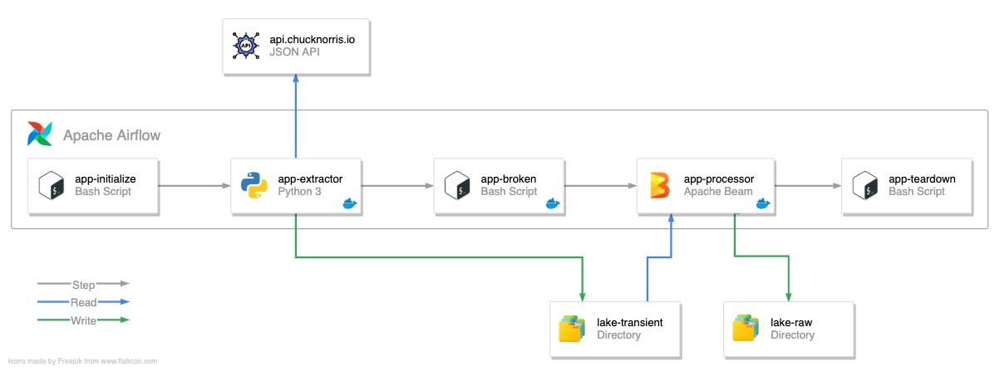
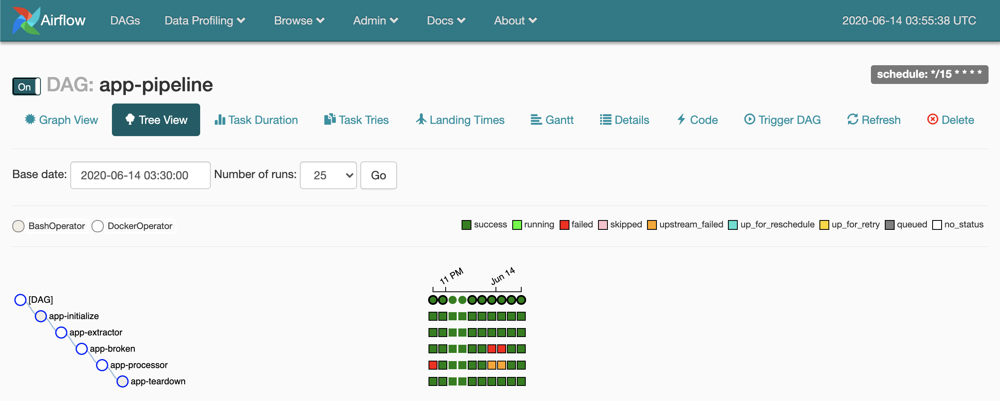

# 🌬 Airflow
By Anthony Vilarim Caliani

[](#) [](#) [](#) [](#) [](#) [](#)

This project is an experiment using [Apache Airflow](https://airflow.apache.org/).

## Diagram


## Go! Go! Go!

### Before you start...
In this project the [Airflow Docker Operator](https://airflow.apache.org/docs/1.10.10/_api/airflow/operators/docker_operator/index.html) is using your local docker instance.  
When you share volumes between the Airflow Container and the Docker Operator Container you must provide a valid path from your local machine and **not** from the Airflow Container, because the docker instance is running in your machine, not in the Airflow Container.  
Having it in mind, let's set up this variable to simplify volumes sharing during the processes.

```bash
export DATALAKE_HOST_PATH="$(pwd)"
```

### Now, let's do this!
```bash
# First, build jobs related images.
./jobs/build-images.sh

# Then, build Airflow image.
docker-compose build

# Finally, up the Airflow container \o/
docker-compose up -d

# When you finish... 
docker-compose down
```

> 💡 Airflow will be running at `http://localhost:8080/admin/`


### Screenshot


## Related Links
- [Airflow: Trigger Rules](https://airflow.apache.org/docs/stable/concepts.html#trigger-rules)
- [Medium: First Steps Using Airflow](https://medium.com/data-hackers/primeiros-passos-com-o-apache-airflow-etl-f%C3%A1cil-robusto-e-de-baixo-custo-f80db989edae)
- [Medium: Airflow Basic Configuration](https://medium.com/@apratamamia/airflow-basic-configuration-for-production-environment-2f69ab0c6f2c)
- [Blog: How to use Docker Operator?](https://marclamberti.com/blog/how-to-use-dockeroperator-apache-airflow/)
- [API: Chuck Norris](https://api.chucknorris.io/)
